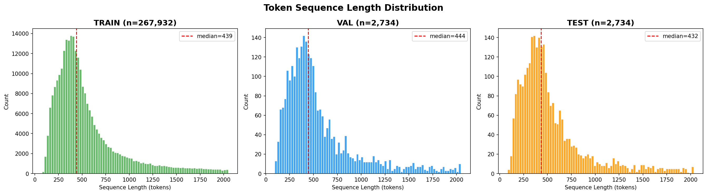
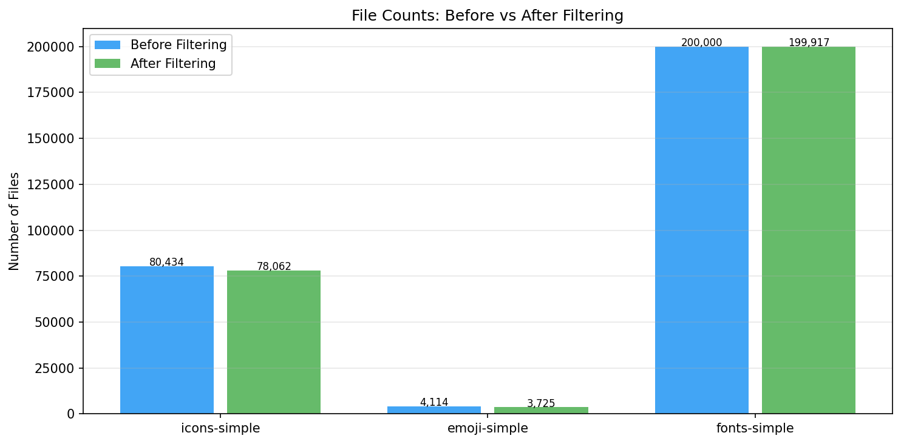
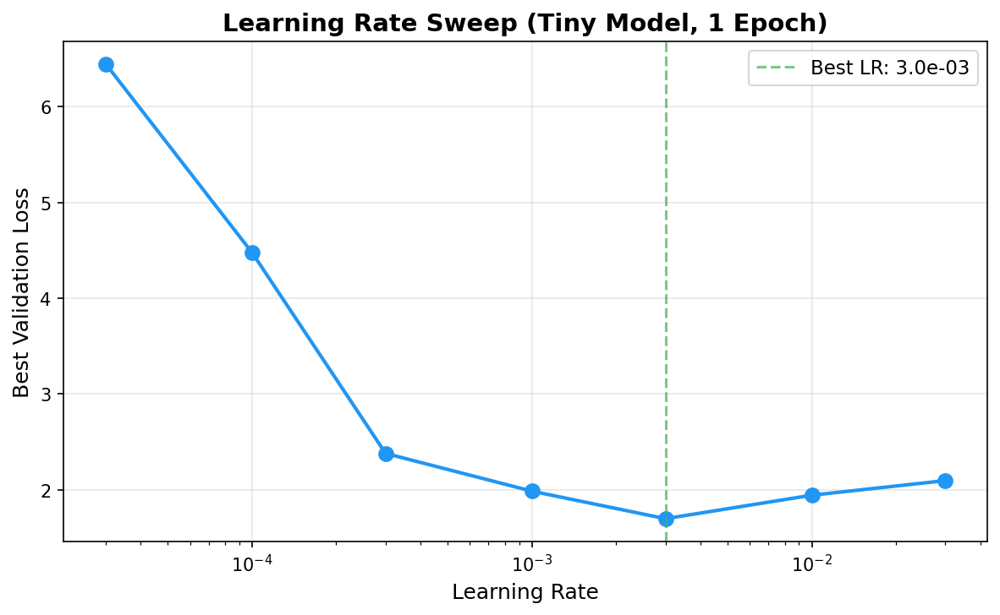
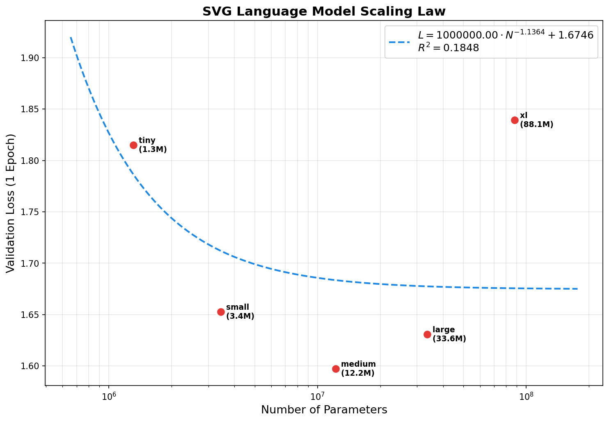
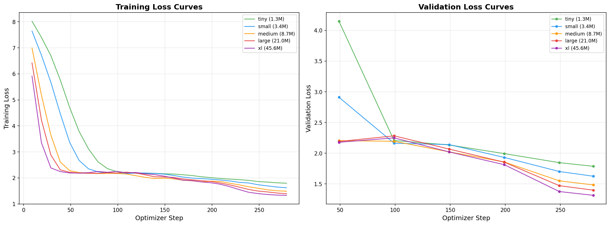
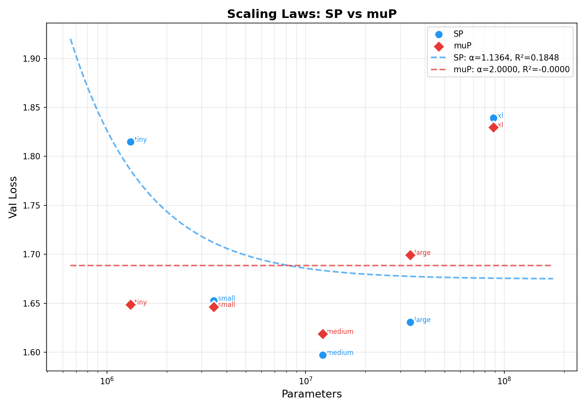
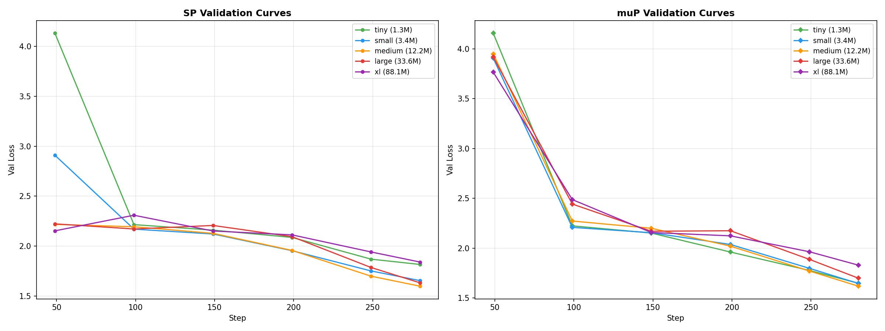
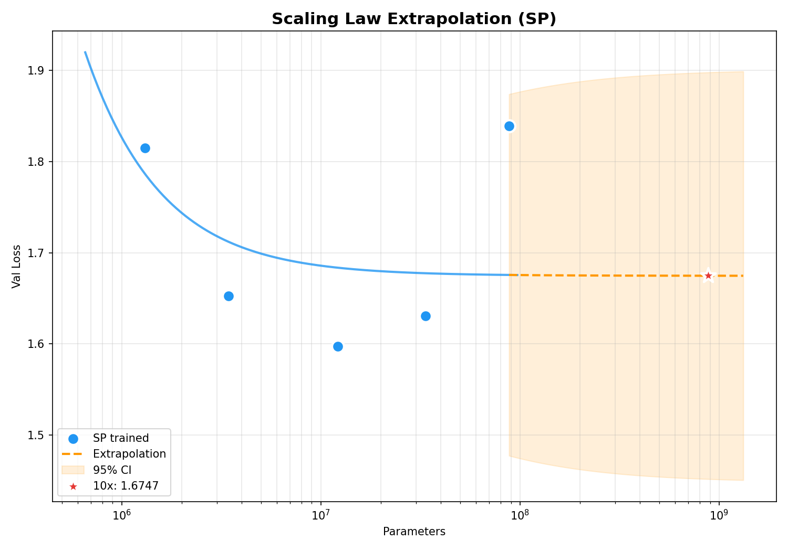
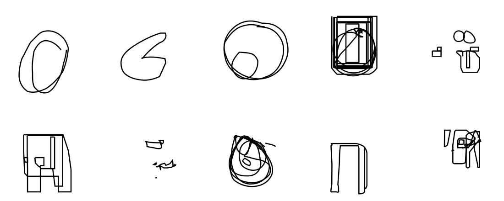

# Scaling Laws for SVG Transformers: A Study of Standard and µP Parameterization

## 1. Introduction

Scaling laws have become a central lens through which researchers understand the behavior of neural language models. Kaplan et al. (2020) and Hoffmann et al. (2022) demonstrated that test loss follows a predictable power law relationship with model size, dataset size, and compute, enabling practitioners to extrapolate the performance of large models from smaller, cheaper experiments. While these laws have been extensively studied for natural language, their applicability to structured, code like domains such as SVG (Scalable Vector Graphics) remains unexplored.

SVG is an XML based format for describing 2D vector graphics. Unlike natural language, SVG has rigid syntactic constraints (well formed XML), a dual nature combining structural markup with numerical coordinate data, and a direct visual interpretation. These properties make it a compelling testbed for studying whether scaling laws transfer to highly structured domains, and whether techniques like Maximal Update Parameterization (µP) can improve hyperparameter transfer across model scales.

**Our approach**: We build a complete pipeline, from data collection to model generation, spanning a family of 5 GPT style transformers from 1.3M to 88M parameters. We study scaling behavior under both standard parameterization (SP) and µP, train a best model for 10 epochs, and evaluate it on SVG generation quality.

---

## 2. Data

### 2.1 Dataset Description

We curated a training corpus from three HuggingFace datasets in the StarVector project:

| Dataset | Source | Files | Description |
|---------|--------|------:|-------------|
| SVG Icons | `starvector/svg-icons-simple` | 80,434 | Simplified SVG icons |
| SVG Emoji | `starvector/svg-emoji-simple` | 4,114 | Simplified SVG emoji |
| SVG Fonts | `starvector/svg-fonts-simple` | 200,000 | Subsampled font glyphs |
| **Total** | | **284,548** | |

### 2.2 Preprocessing Pipeline

Our 5 stage pipeline transforms raw SVGs into a training ready token corpus: (1) **Download** SVG code from HuggingFace, (2) **Clean/Normalize** by parsing XML, stripping metadata and namespaces, sorting attributes alphabetically, rounding coordinates to 1 decimal place, and normalizing whitespace (achieving ~56% size reduction), (3) **Tokenize** using a Byte Level BPE tokenizer (vocab=4,096), (4) **Split** into 98/1/1 train/val/test by file (seed=42), discarding sequences exceeding 2,048 tokens, and (5) **Compute statistics** and render example SVGs.

The filtering removed 2,844 outlier SVGs (top 1% by length) and 8,304 that exceeded 2,048 tokens after tokenization, leaving **273,400 files** and **150.4M tokens**.

### 2.3 Tokenization Scheme

We use **Byte Level BPE** with a vocabulary size of **4,096 tokens**. BPE naturally captures multi character SVG patterns (e.g., `viewBox`, `stroke-width`, `fill="none"`) as single tokens, dramatically reducing sequence length compared to character level tokenization. Byte level pre tokenization handles all characters including XML specials without producing UNK tokens. The vocabulary of 4,096 sits in the recommended 1K to 8K range: large enough to capture common SVG tags, attributes, and path commands, while small enough to keep embedding tables efficient for our 1.3M to 88M parameter models (at 4,096 vocab, the embedding layer is ~0.5M params, manageable even for the Tiny model). The median SVG tokenizes to ~439 tokens (mean ~550). Without BPE (character level), the same SVGs would require ~2,200 characters, a 4 to 5× increase. This compression is critical for fitting complex SVGs within our 2,048 token context window.

### 2.4 Corpus Statistics

| Metric | Value | | Metric | Value |
|--------|-------|-|--------|-------|
| Total tokens | **150.4M** | | Vocabulary size | 4,096 |
| Train tokens | 147.4M | | Context window | 2,048 tokens |
| Val/Test tokens | 1.5M / 1.5M | | Median seq length | 439 tokens |
| Files after filtering | 273,400 | | Mean seq length | 550 tokens |

**Figure 1** — Sequence length distribution (left) and file counts before/after filtering (right).

### 2.5 Rendered SVG Examples

The following examples show cleaned SVGs at different complexity percentiles, illustrating the range of data in our corpus:

| Percentile | Source | Chars | Description |
|-----------|--------|------:|-------------|
| P10 (Simple) | svg-fonts-simple | 469 | Simple font glyph, single path with basic curves |
| P25 (Low) | svg-fonts-simple | 645 | Font glyph with 2 paths, letter with descender |
| P50 (Medium) | svg-fonts-simple | 888 | Moderate glyph, 2 paths with complex curves |
| P75 (Complex) | svg-icons-simple | 1,396 | Icon with 3 overlapping paths, detailed shape |
| P90 (Very Complex) | svg-icons-simple | 2,593 | Complex icon, 10 paths with fine details |

Example SVG files are rendered in `data/stats/examples/` and can be viewed in any browser.

---

## 3. Methods

### 3.1 Model Architecture

We use a decoder only GPT style transformer adapted from nanoGPT (Karpathy, 2022). Key modifications include an explicit `d_ff` parameter for independent control of feed forward width, weight tying between embeddings and output head, and `bias=False` throughout.

| Name | Params | d_model | Layers | Heads | d_ff | Head Dim |
|------|--------|---------|--------|-------|------|----------|
| **Tiny** | 1.3M | 128 | 4 | 4 | 512 | 32 |
| **Small** | 3.4M | 192 | 6 | 6 | 768 | 32 |
| **Medium** | 12.2M | 384 | 6 | 6 | 1,536 | 64 |
| **Large** | 33.6M | 512 | 10 | 8 | 2,048 | 64 |
| **XL** | 88.1M | 768 | 12 | 12 | 3,072 | 64 |

Models span a 67× parameter range. We scale both width and depth simultaneously, which introduces confounding effects on the scaling law analysis as discussed in Section 5.

### 3.2 Training Setup

| Parameter | Value | Rationale |
|-----------|-------|-----------|
| Optimizer | AdamW | Standard for transformer LM training |
| Weight decay | 0.1 | Applied to 2D params only; 1D (biases, LN) excluded |
| Betas | (0.9, 0.95) | Per Chinchilla/nanoGPT conventions |
| Effective batch | 524,288 tokens | micro_batch × grad_accum × 2048 |
| LR schedule | Cosine w/ linear warmup | 200 step warmup, decay to 10% of peak |
| Gradient clipping | 1.0 max norm | Prevents gradient explosions in deeper models |
| Dropout | 0.0 | Standard for scaling law studies |
| Precision | bfloat16 | Mixed precision via torch.amp |

**Scaling study**: All 5 models trained for exactly 1 epoch (147M tokens, 281 steps) with fixed LR=3e-3 (tuned on Tiny via sweep). **Best model**: Large trained for 10 epochs (1.47B tokens, 2,810 steps) with LR=3e-4 on an A100.

### 3.3 µP Implementation

For the µP study, we created a separate architecture (`model_mup.py`) with the following adaptations: (1) `MuSharedReadout` output head (replaces `nn.Linear`) for properly scaled weight tied embeddings, (2) 1/d attention scaling (via `F.scaled_dot_product_attention(scale=8/d)`) instead of 1/√d, (3) zero initialized query projections with fan in scaled hidden weights, and (4) `MuAdamW` optimizer with automatic per layer LR scaling based on inferred base shapes.

### 3.4 Evaluation Metrics

We evaluate using four metrics: **test perplexity** on the held out test set (2,734 files, 1.46M tokens), **XML validity rate** (percentage parsed by `lxml.etree`), **SVG render rate** (percentage rendered to PNG by CairoSVG with a 10 second timeout), and **structural validity** (percentage with proper `<svg>` root and `</svg>` closing in raw output).

---

## 4. Results

### 4.1 Learning Rate Sweep (SP)

We swept 7 learning rates on a log scale using the Tiny model (1.3M params, 4 layers), training for 1 full epoch each.

| LR | Val Loss | Train Loss | | LR | Val Loss | Train Loss |
|----|----------|------------|-|----|----------|------------|
| 3e-5 | 6.449 | 6.454 | | **3e-3** | **1.698** | **1.717** |
| 1e-4 | 4.478 | 4.483 | | 1e-2 | 1.944 | 1.939 |
| 3e-4 | 2.380 | 2.392 | | 3e-2 | 2.096 | 2.106 |
| 1e-3 | 1.986 | 2.003 | | | | |

The sweep exhibits a classic U shape on log scale. At LR=3e-5, the model barely moves from random initialization (~8.3 for a 4,096 vocab model). The sweet spot is at **3e-3**, after which loss rises due to optimization instability. The relatively high optimal LR is expected for a small, shallow model on a structured domain with compact vocabulary.

**Figure 2** — SP Learning Rate Sweep (left) and Scaling Plot with Power Law Fit (right). The LR sweep shows a clear U shape. The scaling plot reveals non monotonic behavior (R²=0.18) because the fixed LR of 3e-3 causes instability in deeper models.

### 4.2 Scaling Study (SP, Fixed LR, 1 Epoch)

| Model | Params | Val Loss | Train Loss | Wall Time | Tok/s |
|-------|--------|----------|------------|-----------|-------|
| Tiny | 1.3M | 1.815 | 1.796 | 3.9 min | 629K |
| Small | 3.4M | 1.653 | 1.622 | 7.5 min | 329K |
| **Medium** | **12.2M** | **1.597** | **1.600** | **12.9 min** | **190K** |
| Large | 33.6M | 1.631 | 1.677 | 29.2 min | 84K |
| XL | 88.1M | 1.839 | 1.828 | 63.9 min | 38K |

**Critical finding**: Scaling is **non monotonic**. The Medium model (12.2M) achieves the best loss, while XL (88.1M) performs *worse* than Tiny. Under standard parameterization, the optimal LR depends on both model width and depth. LR=3e-3 was tuned on the 4 layer Tiny model, but deeper networks (10 layer Large, 12 layer XL) have sharper loss landscapes where gradient updates compound through more layers. The same LR that smoothly trains 4 layers causes severe oscillation in 12 layers. The XL training curve shows loss spiking to 2.51 at step 90 before partially recovering during cosine decay.

**Figure 3** — Training curves for all 5 model sizes. Note the smooth convergence of Tiny/Small/Medium versus the oscillating loss of Large/XL, revealing LR instability at depth.

### 4.3 µP Learning Rate Sweep and Scaling

We re swept the LR using the µP parameterized Tiny model, shifting the range higher (3e-4 to 3e-1) since µP normalizes updates by width.

| LR | µP Val Loss | | LR | µP Val Loss |
|----|-------------|-|----|-------------|
| 3e-4 | 7.946 | | 3e-2 | 1.967 |
| 1e-3 | 7.040 | | **1e-1** | **1.672** |
| 3e-3 | 4.604 | | 3e-1 | 1.805 |
| 1e-2 | 2.224 | | | |

**Best µP LR: 0.1**, a full **33× higher** than SP's optimal (3e-3). This is because µP normalizes parameter updates by layer width, so the optimizer can take much larger global steps without destabilizing hidden representations. Under SP, LR=0.1 would cause instant divergence.

### 4.4 SP vs µP Comparison

| Model | SP Val Loss | µP Val Loss | Δ | Better |
|-------|-------------|-------------|---|--------|
| Tiny | 1.815 | 1.649 | **−0.166** | **µP** |
| Small | 1.653 | 1.646 | **−0.007** | **µP** |
| Medium | **1.597** | 1.619 | +0.022 | SP |
| Large | 1.631 | 1.699 | +0.068 | SP |
| XL | 1.839 | 1.830 | **−0.010** | **µP** |

µP wins at Tiny (−0.166, massive), Small (−0.007), and XL (−0.010), but loses at Medium (+0.022) and Large (+0.068). This is explained by µP's theoretical guarantee: it transfers LR perfectly across **width** but not **depth**. Our model family scales both, so the 4 layer proxy LR does not perfectly suit 10 or 12 layer targets. SP's LR=3e-3 happens to be accidentally well suited for 6 layer networks (Medium), giving it an edge there.

**Figure 4** — SP vs µP scaling comparison. Neither achieves a monotonically decreasing curve due to depth confounding.

**Figure 5** — Training curves comparison between SP (solid) and µP (dashed) across all model sizes.

### 4.5 Scaling Law Extrapolation

Using the SP fit (R²=0.18), we predict for a 10× model (881M params): **Predicted loss: 1.675**, with a **95% CI of [1.451, 1.898]** (±0.223). The extremely wide CI reflects the non monotonic data. The predicted loss of 1.675 for an 881M model is actually *worse* than our 12M Medium model (1.597), highlighting that the power law assumption is violated. A reliable extrapolation would require monotonic scaling, achievable by fixing depth and scaling only width.

**Figure 6** — Extrapolation plot with 95% confidence interval, showing the wide uncertainty band.

### 4.6 Best Model Training (10 Epochs)

For the final generation phase, we selected the **Large model (33.6M params, 10 layers)** and trained it for 10 full epochs on an A100 GPU. We reduced the LR to `3e-4` (10× lower than the sweep optimal) because the 1 epoch scaling study showed oscillation at `3e-3` for the 10 layer depth. This choice was validated by the smooth, monotonic convergence over 10 epochs.

| Metric | Value | | Metric | Value |
|--------|-------|-|--------|-------|
| Final Val Loss | **0.787** | | Training Time | 59 min (A100) |
| Final Train Loss | 0.794 | | Overfitting | None (train ≈ val) |
| Test Perplexity | **2.25** | | Epochs | 10 (1.47B tokens) |

A perplexity of 2.25 means the model narrows its next token choice to ~2 highly probable candidates on average, reflecting the low entropy of structured SVG syntax compared to natural language. The zero overfitting (despite no dropout) indicates the 150M token corpus is sufficient for a 33.6M parameter model at 10 epochs, consistent with Chinchilla optimal ratios.

### 4.7 Generation Evaluation

We generated 21 SVG samples: 10 unconditional, 5 prefix conditioned, and 6 temperature/top k variations. Generation used temperature=0.8 and nucleus sampling (top p=0.95) by default.

| Metric | Score | Analysis |
|--------|-------|----------|
| Structural Validity | 52.4% (11/21) | Percentage with complete `<svg>...</svg>` in raw output |
| XML Validity | **71.4%** (15/21) | Parsed by `lxml.etree` after minimal cleanup |
| SVG Render Rate | 52.4% (11/21) | Rendered to PNG via CairoSVG |

The gap between XML validity (71.4%) and render success (52.4%) reveals that the model learns XML **syntax** (proper tag nesting, attribute format) better than SVG **semantics** (valid path commands, correct namespace URLs). Files that pass XML parsing but fail rendering typically contain malformed path data (e.g., missing `M` move to command) or typographical errors in attribute names (e.g., `xlns` instead of `xmlns`).

**Figure 7** — Rendered grid of unconditional samples (left) and prefix completions (right).

**Selected individual renders** from unconditional generation:

---

## 5. Discussion

### 5.1 Tokenization Strategy

We chose Byte Level BPE at vocab=4,096 because SVG requires handling XML structural characters, numeric coordinates, and keywords simultaneously. Character level tokenization would produce 4 to 5× longer sequences, exceeding our 2,048 context window for most SVGs. A larger vocabulary (8K+) would improve compression but increase the embedding table size disproportionately for our smallest models, where the embedding layer already dominates parameter count. The 4,096 sweet spot ensures every model in our family has meaningful capacity beyond just the embedding table.

### 5.2 Architecture Choices

We scale both width and depth following the assignment specification (4 to 12 layers). In hindsight, this dual scaling confounded our scaling law analysis: depth changes fundamentally alter the loss landscape in ways that width scaling does not, making it impossible to isolate the effect of model size on performance. A cleaner experiment would fix depth at 12 layers and scale only width. The context window of 2,048 tokens accommodates 95th percentile SVG complexity while remaining tractable for the smallest models.

### 5.3 Training Decisions

**Batch size (524K tokens)** matches Chinchilla scale proportions; larger batches reduce gradient noise, which is critical for structured data where a single syntax error compounds. The **cosine LR schedule** prevents the LR from staying high too long, which is critical for deeper models where high LR causes oscillation (as observed in the XL training curve). **No dropout** is standard for scaling law studies, confirmed by our 10 epoch training where train/val loss remained identical (0.79). The **LR of 3e-4 for the best model** was reduced 10× from the sweep optimal because the 10 layer Large showed oscillation at 3e-3 during the scaling study, and was validated by smooth monotonic convergence over 10 epochs.

### 5.4 Scaling Insights

Our SP scaling exponent (α ≈ 1.14, R²=0.18) is not directly comparable to Kaplan et al.'s natural language exponent (α ≈ 0.076) because our experiment confounds width and depth scaling with a fixed LR, producing non monotonic data. However, the underlying potential for SVG scaling is evident: the Large model went from 1.63 (1 epoch) to 0.79 (10 epochs), suggesting that with proper LR tuning per scale, SVG would exhibit clean power law behavior. The low entropy nature of SVG (rigid syntax, repetitive patterns, small vocabulary) means models achieve very low perplexity (2.25) even at moderate scale (33M params). Natural language requires much larger models for comparable confidence.

### 5.5 Learning Rate Scaling Insights

µP enables **33× higher learning rates** (SP optimal was 3e-3; µP optimal was 1e-1). **Width transfer works but depth transfer does not**: µP improved performance at the extremes (Tiny: −0.166, XL: −0.010) but underperformed at middle sizes where SP's LR was accidentally well suited for 6 layer networks. The practical takeaway is that µP is most valuable when you cannot afford per scale LR tuning. For width only scaling (the intended use case per Yang et al., 2022), µP would provide near perfect transfer.

### 5.6 SVG Specific Patterns

Even at the 1 epoch stage, we observed scale dependent learning. **Tiny (1.3M)** learns basic XML syntax (opening/closing tags, attribute format) but produces repetitive paths. **Small/Medium (3 to 12M)** learn SVG conventions (standard viewBox sizes, common attributes, color formats). **Large (33M, 10 epochs)** learns spatial coherence: paths form recognizable shapes with smooth Bézier curves, and the model respects the coordinate system established by the viewBox. Color consistency also improves significantly (warm palette prefix produces warm completions). No clear phase transitions were observed, likely because 1 epoch training was insufficient to fully exploit larger model capacity.

### 5.7 Challenges and Future Work

(1) **Depth confounding**: Simultaneous width and depth scaling broke the power law; future work should use a width only scaling family. (2) **CairoSVG instability**: The renderer hangs on malformed path data; we implemented a threaded timeout as a workaround. (3) **Insufficient training budget**: 1 epoch is insufficient for convergence at scale; the Large model improved from 1.63 to 0.79 over 10 epochs. (4) **µP depth limitations**: µP guarantees apply to width only; depth aware parameterization (e.g., Depth µP) would be more appropriate. (5) **Generation quality**: The 52% render rate could improve with SVG aware loss functions or post processing repair heuristics.

---

## 6. Conclusion

We conducted a comprehensive study of scaling laws for SVG transformers, training a family of 5 models from 1.3M to 88.1M parameters. First, **fixed LR scaling fails for depth varying architectures**: under SP with a single LR, larger and deeper models performed worse (R²=0.18). Second, **µP provides partial protection**: µP transferred a 33× higher LR across widths, improving performance at the extremes but not overcoming the depth mismatch. Third, **SVG models achieve very low perplexity**: our best model (33.6M, 10 epochs) achieved a test perplexity of 2.25 with 71.4% XML validity, demonstrating strong SVG syntax learning. Fourth, **clean scaling requires controlled experiments**: future work should isolate width from depth scaling and use compute matched training for reliable power law extrapolation.

---

## References

1. Kaplan, J. et al. (2020). "Scaling Laws for Neural Language Models." arXiv:2001.08361.
2. Hoffmann, J. et al. (2022). "Training Compute Optimal Large Language Models." arXiv:2203.15556.
3. Yang, G. et al. (2022). "Tensor Programs V: Tuning Large Neural Networks via Zero Shot Hyperparameter Transfer." arXiv:2203.09789.
4. Karpathy, A. (2022). nanoGPT. https://github.com/karpathy/nanoGPT.
5. Rodriguez, J.D. et al. (2023). StarVector. https://huggingface.co/starvector.

---

## Appendix A: Additional Generated SVGs

Individual rendered samples from unconditional generation:

